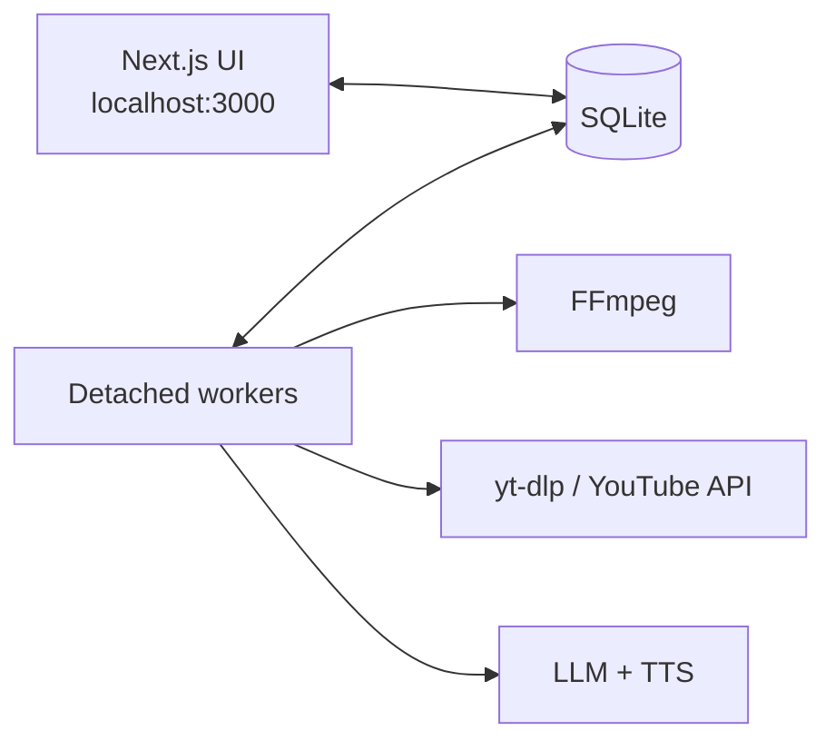

# YT Short Creator

**Local Short Control for [S.Marcato 42 Racing](https://github.com/marcatos)** — analyze the channel, propose branded YouTube Shorts, approve on `localhost`, then render and upload without leaving the desk.

[](https://github.com/marcatos/yt-short-creator/actions/workflows/ci.yml)


Pipeline: **analyze → propose → brand render → human approve → upload**.

Built as a single-operator desktop web app — not a multi-tenant SaaS. Every publish path requires an explicit Approve.

## Why it exists

Shorts are how a race channel grows between long-form uploads. This tool mines existing masters, generates new hooks when inventory is thin, and pulls highlight packages from iRacing replays — then wraps every cut in S.Marcato 42 Racing brand language (carbon / ice / Rosso Corsa) before it ever touches YouTube.

The operator stays in the loop. The machine does the heavy lifting: download, analysis, FFmpeg render, OAuth upload, bilingual voice-over and captions, and daily upload-limit deferrals.

## What it does

| Surface | Role |
|---------|------|
| **Library** | Sync the channel catalog; **Analyze clips** from long-form; **Generate ideas** for original Shorts |
| **Inspiration** | Mirror YouTube Studio Inspiration ideas; **Sync now** or scheduled job; stale badge when ideas age out |
| **Replays** | iRacing `.rpy` / OBS / telemetry workflow — Director capture, auto-record, full-race publish |
| **Candidates** | Triage by origin (`clip` / `generate` / `replay`) and status; revise, reject, or approve |
| **Jobs** | Live queue — pause, resume, cancel, reorder; respects YouTube daily upload limits |
| **Setup** | Hardware / desk copy blocks for descriptions (IT + EN), never LLM-invented |
| **Settings** | Brand root, privacy defaults, encoder prefs, IT/EN TTS voices, VO / caption flags |
| **Connect** | YouTube OAuth for the intended channel |

After Approve: workers enqueue `render_short` → `publish_short`. Optional bilingual IT/EN voice-over and captions ride the same review path.

Deeper product map: [docs/overview.md](docs/overview.md).

## How it runs



Heavy work never runs inside the Next process. The UI enqueues jobs; a dedicated worker process owns FFmpeg, downloads, analysis, and uploads so the dashboard stays responsive on large OBS masters.

- **Production (Windows):** detached daemon — `npm run daemon:start` (web + workers). See [docs/daemon.md](docs/daemon.md).
- **Development:** two terminals — `npm run dev` + `npm run workers`.

## Prerequisites

- **Node.js** 25 (see `.nvmrc`) and npm
- **FFmpeg** on your `PATH` (download, analysis, render)
- **yt-dlp** on your `PATH` (YouTube media download)
- Sibling brand pack at `BRAND_ROOT` (default: `../smarcato42-racing`) with brand tokens and assets

## Quick start

1. Copy the environment template and adjust paths:

   ```bash
   cp .env.example .env.local
   ```

2. Set `BRAND_ROOT` to the absolute path of your brand checkout (see `.env.example`).

3. Install dependencies, then start:

   **Production daemon (recommended on Windows):**

   ```bash
   npm install
   npm run daemon:start
   ```

   Builds if needed, starts `next start` + workers as **detached** processes, then exits — you can close the shell.

   ```bash
   npm run daemon:status
   npm run daemon:logs
   npm run daemon:stop
   ```

   Optional: auto-start at Windows logon → `npm run daemon:install-autostart`

   **Local UI development (two terminals):**

   ```bash
   npm run dev        # Terminal A — localhost UI only
   npm run workers    # Terminal B — FFmpeg / YouTube / analysis jobs
   ```

4. Open [http://localhost:3000](http://localhost:3000).

## Environment variables

| Variable | Purpose |
|----------|---------|
| `LOG_LEVEL` | `DEBUG`, `INFO`, `WARN`, or `ERROR` |
| `BRAND_ROOT` | Path to S.Marcato 42 Racing brand assets |
| `YOUTUBE_*` | OAuth credentials for YouTube Data API v3 |
| `LLM_*` / `TTS_*` | OpenAI-compatible LLM and TTS endpoints |
| `WHISPER_MODEL` | Optional transcription model (reuses LLM credentials) |
| `DATABASE_PATH` | SQLite database file (default `./data/app.db`) |
| `MEDIA_ROOT` | Local media storage (default `./media`) |
| `IRACING_VIDEOS_DIR` | Optional iRacing capture watch folder |
| `FFMPEG_VIDEO_ENCODER` | Optional encoder override (prefer Settings UI) |
| `YOUTUBE_STUDIO_PROFILE_DIR` | Persistent Chrome profile for Studio automation (default `data/youtube-studio-profile`) |
| `YOUTUBE_STUDIO_BROWSER_CHANNEL` | Playwright browser channel for workers (default `chrome`) |
| `YOUTUBE_STUDIO_CHROME_PATH` | Optional path to `chrome.exe` for `studio:login` |
| `YOUTUBE_STUDIO_CDP_PORT` | Remote-debugging port for login (default `9222`) |
| `INSPIRATION_SYNC_INTERVAL_HOURS` | Scheduled Inspiration sync interval (default `24`) |

One-time headed sign-in: `npm run studio:login` opens **real** Google Chrome (CDP), not a Playwright-controlled window — Google blocks the latter. Complete login in that window, then press Enter. Workers reuse the same profile; Studio scrape runs **headed by default** (set `YOUTUBE_STUDIO_HEADED=0` only to force headless).

## YouTube OAuth

1. Create a project in [Google Cloud Console](https://console.cloud.google.com/).
2. Enable **YouTube Data API v3**.
3. Create OAuth 2.0 credentials (Web application).
4. Add authorized redirect URI: `http://localhost:3000/api/auth/youtube/callback`
5. Copy **Client ID** and **Client secret** into `.env.local` as `YOUTUBE_CLIENT_ID` and `YOUTUBE_CLIENT_SECRET`.

## Acceptance

Run this checklist against a test channel before accepting a release:

- [ ] Configure real OAuth credentials, start the app, and connect the intended YouTube channel.
- [ ] In **Settings**, set **Default privacy** to **Unlisted** and save.
- [ ] Generate or clip one disposable candidate, review its metadata, and approve it.
- [ ] Confirm the render and publish jobs both finish successfully with no retries or logged secrets.
- [ ] Open the returned video in YouTube Studio and confirm it is **Unlisted**, vertical, playable, and contains `#Shorts`.
- [ ] Confirm subscribers were not notified, then delete the disposable upload if it is no longer needed.
- [ ] (Optional) On **Replays**, use **Director capture** for highlight shots (or **Auto-record** for a continuous take), then approve a `REPLAY` candidate. iRacing must allow video capture.

## Scripts

| Command | Description |
|---------|-------------|
| `npm run daemon:start` | Production daemon (detached web + workers) |
| `npm run daemon:status` | Check daemon PIDs + HTTP without the start shell |
| `npm run daemon:logs` | Tail `data/daemon/*.log` |
| `npm run daemon:stop` | Stop daemon processes |
| `npm run daemon:restart` | Stop + start |
| `npm run daemon:install-autostart` | Windows Scheduled Task at logon |
| `npm run dev` | Start Next.js UI only (dev; does **not** run heavy job workers) |
| `npm run workers` | Dedicated worker process (dev companion to `npm run dev`) |
| `npm run build` | Production build |
| `npm run start` | Start production server |
| `npm test` | Run Vitest |
| `npm run db:generate` | Generate Drizzle migrations |
| `npm run db:migrate` | Apply Drizzle migrations |
| `npm run studio:login` | One-time headed YouTube Studio sign-in (shared Playwright profile) |

## Further reading

- [Product overview](docs/overview.md) — routes, pipeline, stack, forking notes
- [Production daemon](docs/daemon.md) — operator guide for detached web + workers
- [Core design spec](docs/superpowers/specs/2026-08-11-yt-short-creator-design.md) — domain model and product contract

Agent policies for this repo (commit/push `main`, daemon restart-if-running): [AGENTS.md](AGENTS.md), [docs/git.md](docs/git.md).
