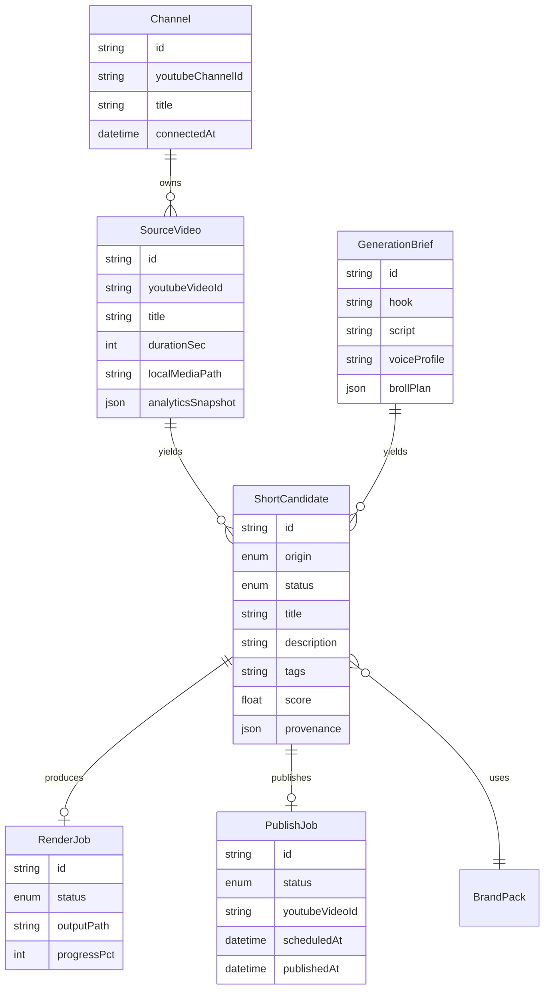
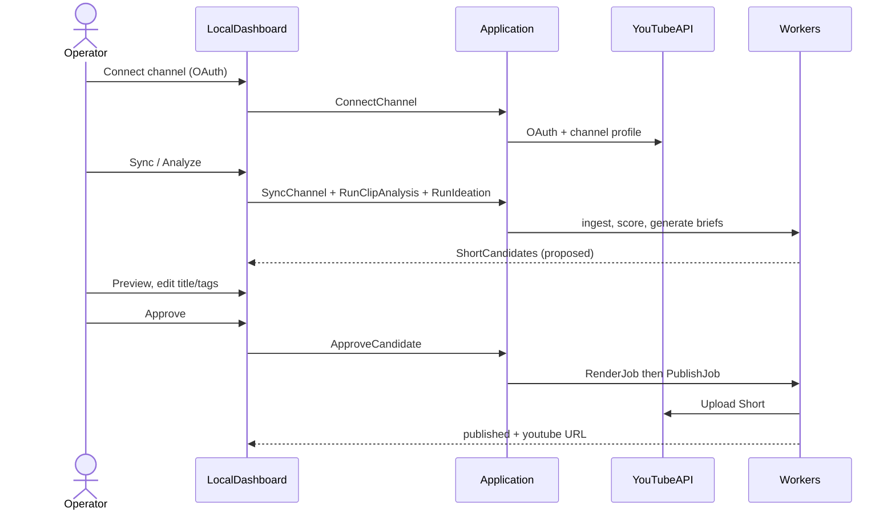
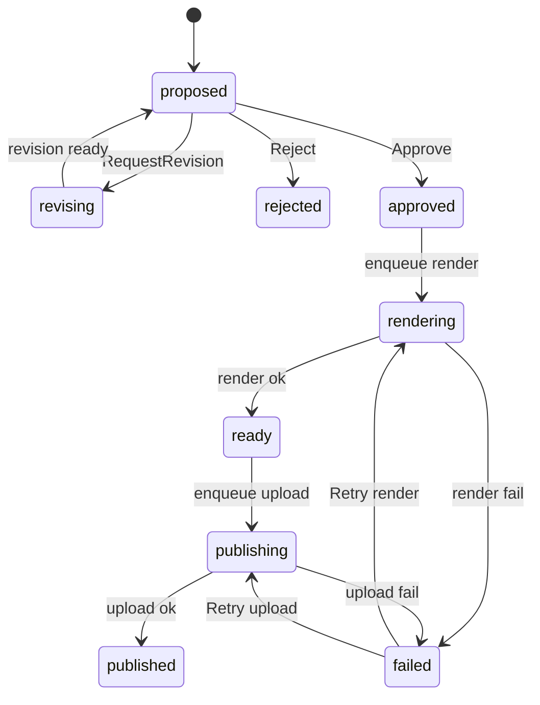
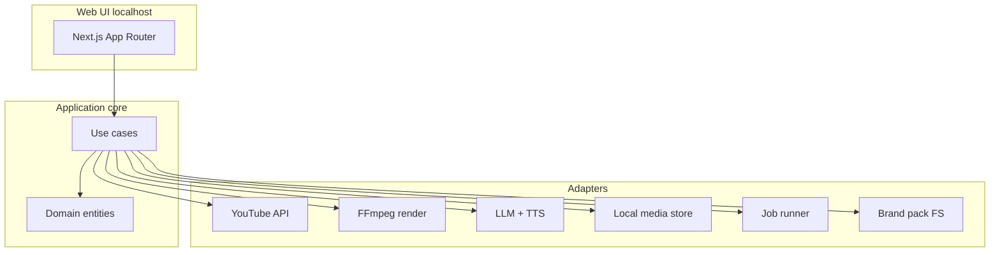

# YT Short Creator — Design Spec

**Date:** 2026-08-11  
**Brand:** S.Marcato 42 Racing  
**Status:** Approved product framing → design locked for implementation

## 1. Purpose

Local desktop-operated web app that analyzes the operator’s YouTube channel, proposes Shorts from **existing long-form clips** and **ex-novo generation**, renders them with S.Marcato 42 Racing branding, and **autonomously uploads only after human approval**.

## 2. Product contract (locked)

| Decision | Choice |
|----------|--------|
| Output | Full pipeline: analyze → propose → brand render → approve → upload |
| Sources | Clip path **and** generate path in first usable release |
| Runtime | Local app + web UI on `localhost` |
| Publish gate | Human approval required; upload is automatic after Approve |
| Brand | Assets/tokens from sibling repo `smarcato42-racing` |

### Goals

- Attract viewers and followers to the S.Marcato 42 Racing channel via Shorts.
- Mine long-form for high-signal clips; generate original Shorts when clip inventory is thin.
- Never publish without explicit approval.

### Out of scope (v1)

- Multi-user / multi-channel SaaS
- Auto-publish without approval
- Full NLE editor parity
- Cross-post to TikTok / Instagram

### Success criteria

1. Operator can go from connected channel → approved Short → live or scheduled YouTube Short without leaving the local app.
2. Clip-origin and generate-origin Shorts share the same approval and upload path.
3. Rendered Shorts match brand guidelines (carbon/ice, Rosso Corsa accent, −18° abstract language, clearspace).

---

## 3. Domain model

### 3.1 Core entities



### 3.2 Enumerations

**`ShortCandidate.origin`**

- `clip` — derived from a `SourceVideo` time window
- `generate` — derived from a `GenerationBrief`

**`ShortCandidate.status`**

| Status | Meaning |
|--------|---------|
| `proposed` | Created by analysis/generation; awaiting operator review |
| `revising` | Operator requested changes; worker regenerating metadata/media |
| `approved` | Operator approved; render+upload pipeline may proceed |
| `rejected` | Discarded; retained for audit |
| `rendering` | Active `RenderJob` |
| `ready` | Render succeeded; upload enqueued or waiting schedule |
| `publishing` | Active `PublishJob` |
| `published` | Live or successfully scheduled on YouTube |
| `failed` | Terminal failure on render or publish (retryable from UI) |

**`RenderJob.status` / `PublishJob.status`:** `queued` | `running` | `succeeded` | `failed` | `cancelled`

### 3.3 Provenance shapes

**Clip provenance** (`origin = clip`):

```json
{
  "sourceVideoId": "…",
  "startMs": 120000,
  "endMs": 145000,
  "hookReason": "peak energy + clear punchline",
  "crop": { "mode": "center_vertical", "focusX": 0.5 }
}
```

**Generate provenance** (`origin = generate`):

```json
{
  "generationBriefId": "…",
  "scriptVersion": 1,
  "voiceAssetPath": "…",
  "timeline": [{ "asset": "broll_1.mp4", "startMs": 0, "endMs": 3000 }]
}
```

### 3.4 Domain services (pure / application orchestration)

| Service | Responsibility |
|---------|----------------|
| `ChannelSync` | Pull channel + video metadata; refresh analytics snapshots |
| `ClipMomentAnalyzer` | Score moments in a `SourceVideo`; emit clip `ShortCandidate`s |
| `ShortIdeation` | Produce `GenerationBrief` + generate-origin candidates from channel themes |
| `BrandComposer` | Map brand pack → overlay timeline (logo, stripes, lower-third, CTA) |
| `ShortRenderer` | Compose 9:16 media via FFmpeg (port); write `RenderJob` output |
| `ApprovalGate` | Transition `proposed` → `approved` / `rejected` / `revising` only from UI |
| `Publisher` | After approve (+ successful render): upload via YouTube API; set visibility/schedule |

**Invariant:** `Publisher` must refuse candidates not in `approved`/`ready`/`publishing` with a successful render artifact. No silent publish from analysis.

### 3.5 Ports (hexagonal)

**Driven (outbound)**

- `YouTubeAuthPort` — OAuth token store / refresh
- `YouTubeCatalogPort` — list channel videos, metadata, analytics where available
- `YouTubeUploadPort` — resumable upload, set snippet/status (`#Shorts`, privacy, schedule)
- `MediaStorePort` — local paths for downloads, intermediates, finals
- `VideoDownloadPort` — fetch source media for clipping
- `LlmPort` — analysis, hooks, scripts, titles/descriptions
- `TtsPort` — voiceover for generate path
- `RenderPort` — FFmpeg (or equivalent) compose/export
- `BrandPackPort` — resolve tokens + asset paths from configured brand root
- `JobQueuePort` — enqueue/run long jobs with progress events
- `ClockPort` / `IdPort` — testable time and IDs

**Driving (inbound)**

- `ConnectChannel` / `SyncChannel`
- `RunClipAnalysis` / `RunIdeation`
- `ListCandidates` / `GetCandidate`
- `UpdateCandidateMetadata`
- `ApproveCandidate` / `RejectCandidate` / `RequestRevision`
- `RetryFailedJob`
- `GetJobProgress`

---

## 4. Flows

### 4.1 End-to-end (happy path)



### 4.2 Clip path

1. Sync `SourceVideo` list; download media for selected/prioritized videos.
2. Transcribe or use captions when available; LLM + heuristics score candidate windows (8–60s).
3. Emit `ShortCandidate(origin=clip)` with provenance window + draft metadata.
4. Operator previews rough cut (player seeks to window) → Approve.
5. `RenderJob`: vertical crop, captions optional, brand overlays, export MP4.
6. `PublishJob`: autonomous upload.

### 4.3 Generate path

1. From channel themes / top-performing topics, `ShortIdeation` creates `GenerationBrief` (hook, script, B-roll plan).
2. Emit `ShortCandidate(origin=generate)`.
3. On Approve (or pre-render for preview): TTS + assemble B-roll/stock/local footage + brand pack.
4. Same `RenderJob` → `PublishJob` chain as clip path.

### 4.4 Approval → autonomous upload



**Policy (v1):** Approve means “render if needed, then upload with current metadata.” Default visibility: `public` immediately, unless operator set a `scheduledAt` on the candidate before Approve.

### 4.5 Error handling

- OAuth expiry: UI shows reconnect; jobs pause with `failed` reason `auth_expired`.
- Download/render/upload failures: job `failed` + candidate `failed`; structured logs with correlation `candidateId` / `jobId`; Retry from UI.
- Partial uploads: YouTube resumable upload session persisted on `PublishJob`.

---

## 5. Dashboard / approval UX

### 5.1 Visual language

Apply S.Marcato 42 Racing tokens (not generic purple SaaS):

- Surfaces: Carbon `#08080A`, Carbon Mid `#121216`
- Type/marks: Ice `#F8F8FA`, Ice Dim `#C8C8D0`, Silver `#A8A8B0`
- Accent: Rosso Corsa `#E10600` (primary CTA / Approve)
- Motifs: −18° parallelogram stripes, hairlines, optional chevron (clear of logo)
- Display: Audiowide-inspired headings where licensed fonts are available; UI body Segoe UI / system sans
- Brand assets resolved from configurable path to `smarcato42-racing/brand-identity` (logos, story templates, social crops)

### 5.2 Information architecture

| Route | Purpose |
|-------|---------|
| `/` | Home: channel status, last sync, pipeline summary counts |
| `/connect` | OAuth connect / reconnect |
| `/library` | Source videos: sync state, duration, “Analyze clips” |
| `/candidates` | Queue of Short candidates (filters: status, origin) |
| `/candidates/[id]` | Review detail: preview, metadata editors, actions |
| `/jobs` | Render/publish job list + live progress |
| `/settings` | Brand pack path, LLM/TTS keys (never logged), default privacy/schedule, log level |

### 5.3 Candidates queue

One primary job: triage Shorts.

- Rows: thumbnail/poster, origin badge (`CLIP` / `GEN`), score, status, proposed title, source hint
- Filters: `proposed` | `approved…` | `failed` | all; origin clip/generate
- Sort: score desc (default), newest

No card clutter on home hero: home is brand + channel pulse + one CTA (“Review queue”).

### 5.4 Review detail (approval surface)

Single composition focused on decision:

1. **Vertical preview** (9:16) — clip window or generated draft
2. **Metadata** — title, description, tags (editable); `#Shorts` always appended at publish if missing
3. **Provenance panel** — timestamps + reason (clip) or script + brief (generate)
4. **Actions**
   - **Approve** (Rosso) — locks metadata snapshot → render → upload
   - **Reject**
   - **Revise** — note field → worker refreshes script/window/metadata → back to `proposed`
5. Optional: schedule datetime before Approve

### 5.5 Jobs / progress

- List with % progress, ETA when known, duration logs
- Expandable log excerpt (INFO+); DEBUG via settings
- Never display API keys or tokens

### 5.6 Motion (2–3 intentional)

1. Queue row status chip transition on approve
2. Progress bar on active render/publish
3. Subtle −18° stripe drift on empty/home brand panel (low amplitude)

---

## 6. Architecture (runtime)



**Recommended stack**

| Layer | Choice |
|-------|--------|
| UI + API routes | Next.js (TypeScript) on localhost |
| Domain / use cases | TypeScript hexagonal modules under `src/domain`, `src/application`, `src/ports`, `src/adapters` |
| Jobs | In-process queue with persisted job records (SQLite) for v1 |
| DB | SQLite via Drizzle or Prisma |
| Media | FFmpeg CLI |
| YouTube | Google OAuth 2.0 + YouTube Data API v3 |
| LLM | Provider behind `LlmPort` (OpenAI-compatible or Anthropic; env-configured) |
| TTS | Provider behind `TtsPort` (env-configured) |
| Logging | Structured logger (pino or equivalent), levels DEBUG/INFO/WARN/ERROR, configurable |

**Brand integration:** settings `BRAND_ROOT` points at `…/smarcato42-racing`; adapter reads `brand-identity/brand-tokens.json` + logo/story assets. Do not vendor-copy entire brand repo; reference path + thin manifest of required files.

### Observability requirements

- Log start/end of every use case and job step with durations
- Progress: processed/total, %, ETA for multi-video analysis and renders
- Correlation IDs: `candidateId`, `jobId`, `channelId`
- No secrets in logs

### Performance constraints

- Do not re-download media already present and unchanged
- Batch YouTube list calls; avoid N+1
- Analysis and render off the request thread via job queue
- Cap concurrent FFmpeg jobs (default 1 on local machines)

---

## 7. Testing strategy

- **Domain:** pure unit tests for status transitions and approval invariants
- **Application:** use-case tests with fake ports
- **Adapters:** contract tests where feasible; FFmpeg/YouTube behind fakes in CI
- **UI:** smoke tests for queue + approve action wiring
- Manual: one real OAuth upload to unlisted Short in operator acceptance

---

## 8. Security & privacy

- Single-operator local tool; tokens in OS user data / `.env.local` (gitignored)
- OAuth scopes minimal: YouTube upload + readonly channel/analytics as required
- Brand path and media stay on disk; no cloud media store in v1

---

## 9. Repo layout (target)

```
yt-short-creator/
  docs/superpowers/specs/
  docs/superpowers/plans/
  src/
    domain/
    application/
    ports/
    adapters/
      youtube/
      ffmpeg/
      llm/
      tts/
      brand/
      db/
      logging/
    ui/                 # or app/ for Next.js App Router
  tests/
  .env.example
  README.md
```

---

## 10. Open implementation defaults (non-blocking)

| Topic | Default for v1 |
|-------|----------------|
| Schedule | Optional; default publish `public` immediately on successful upload |
| Captions on Shorts | Burn-in optional toggle default ON for generate, OFF for clip if source has burnt-in text risk |
| B-roll for generate | Local `media/broll` folder + optional stock API later |
| Language | Italian primary metadata/scripts; configurable |

---

## 11. Spec self-review

- No TBD placeholders for v1 scope decisions
- Clip and generate both required in first usable release; shared approval/upload path enforced in domain
- Out of scope explicit: multi-tenant, autopilot publish, full NLE, other socials
- Dependencies point inward (adapters → ports → application → domain)
