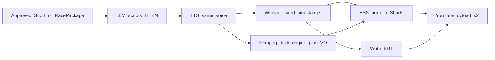

# Bilingual VO + word-sync captions — Design Spec

**Date:** 2026-08-12  
**Brand:** S.Marcato 42 Racing  
**Status:** Approved for planning (design locked in chat)

## 1. Purpose

Add catchy, brand-consistent artificial voice-over in **Italian and English**, with **word-level captions** that appear as spoken, to grow YouTube traffic for S.Marcato 42 Racing (simracing Shorts + full race uploads).

## 2. Product decisions (locked)

| Decision | Choice |
|----------|--------|
| Scope | Shorts **and** full race videos |
| Language delivery | **Two uploads per piece** (IT + EN), not multi-audio |
| Captions | Soft subs (`.srt`) for YouTube **and** burn-in on Shorts by default |
| Voice stack (v1) | OpenAI-compatible TTS already in repo + Whisper word timestamps |
| Voice identity | Single fixed brand `voiceProfile` for both IT and EN |
| Full burn-in | Optional (soft always; burn-in toggle later / off by default for full) |

### Goals

- Same speaker “personality” across IT and EN.
- Energetic, simracing-appropriate tone; clear CTA toward the channel / full video.
- Captions readable on mute Shorts autoplay; soft captions for accessibility and SEO on YouTube.

### Non-goals (v1)

- ElevenLabs / Azure (deferred; TTS port stays swappable).
- YouTube multi-audio tracks on one video.
- Manual NLE timeline editor.
- Live streaming VO.

### Success criteria

1. From an approved Short candidate (replay origin), operator can produce **IT + EN** renders with VO + burn-in words and soft SRT, then upload both.
2. From a published/analyzed full race session with `racePackage`, operator can produce **IT + EN** full encodes with soft SRT (burn-in optional) and upload both.
3. Same `voiceProfile` string is used for IT and EN synthesis.
4. Word highlight timing is derived from the TTS audio (not guessed from script length alone).

## 3. Voice & copy guidelines

### Brand voice (TTS)

- **Profile (v1 default):** `coral` (configurable in settings / env).
- **Tone:** energetic, competitive, clear; “simracing highlight reel,” not ASMR, not robotic newsreader.
- **Instructions (when model supports):** short system-style instruction baked into synthesis prompt or `instructions` field if API allows — e.g. “Energetic simracing commentator for YouTube Shorts; punchy, invite viewers to the channel.”

### Script rules

- **Shorts (8–25 s spoken):** hook in first 2 s; name the moment; end with CTA (subscribe / full race link).
- **Full:** chaptered narration aligned to `racePackage.timeline` beats; denser than Shorts but still catchy; CTA mid + end.
- Generate **Italian first**, then **English** as adaptation (not literal calque) keeping energy and CTA.
- Focus car: white/black/green π / S.Marcato 42 — never invent results that contradict the race package.

## 4. Pipeline

### 4.1 Shorts (replay / clip)

1. On approve (or explicit “Render VO IT+EN”), LLM writes `scriptIt` + `scriptEn` from candidate metadata + hook.
2. TTS → `media/.../vo-it.mp3`, `vo-en.mp3` with brand voice.
3. Whisper verbose (word timestamps) on each VO file → word cue lists.
4. FFmpeg render 9:16: game audio ducked under VO; ASS karaoke-style burn-in (active word highlight).
5. Write `.srt` beside render.
6. Enqueue **two** publish jobs (IT then EN) with language-appropriate title/description/tags; attach captions via YouTube Captions API when connected.

### 4.2 Full race

1. From `racePackage` + timeline, LLM writes longer IT/EN narration (chunked if needed for TTS limits).
2. TTS + Whisper align as above.
3. Mix VO onto YouTube-delivery encode (or produce VO variants from existing `full-youtube.mp4`).
4. Soft SRT always; burn-in off by default for full.
5. Two uploads (IT + EN), `contentKind: "full"`, no `#Shorts`.

## 5. Domain / ports (hexagonal)

### New / extended concepts

- `VoiceOverPackage`: `{ language: "it" | "en"; script; voiceProfile; audioPath; words: { text, startMs, endMs }[]; srtPath; }`
- Candidate / session links to IT+EN packages and sibling YouTube IDs.
- Extend `TtsPort` optionally with `instructions?: string` (backward compatible).
- Extend `TranscriptionPort` (or aligner port) to request **word** timestamps.
- Caption burn-in in FFmpeg render path (`burnInCaptions` already stubbed on `RenderInput`).
- YouTube captions upload port method (or extend upload port).

### Settings

- `brandVoiceProfile` (default `coral`)
- `shortsBurnInCaptions` (default true)
- `fullBurnInCaptions` (default false)
- Ducking level (default −12 dB game under VO)

## 6. UI

- Candidates: show IT/EN VO status; approve still gates publish; optional “Generate VO IT+EN” before approve if analysis-only.
- Replays / full publish: checkbox or button “Upload IT + EN with VO”.
- Settings: voice profile selector (documented OpenAI voice ids).

## 7. Observability & performance

- Log start/end and durations for script, TTS, align, mix, burn-in, upload per language.
- Progress on jobs: script → tts → align → render → captions → upload.
- Avoid loading entire race masters into memory; mix from delivery encode / seek windows for Shorts.
- Cache TTS+align artifacts by `(scriptHash, voiceProfile, language)`.

## 8. Risks & mitigations

| Risk | Mitigation |
|------|------------|
| Whisper word sync drift | Prefer aligning TTS-only audio (clean); pad ASS highlight slightly |
| TTS length limits on full | Chunk narration by timeline chapters; concat audio |
| Double quota / spammy uploads | Default privacy unlisted for EN test; schedule spacing later |
| Voice not catchy enough | Keep TTS port swappable; migrate to ElevenLabs without redesign |

## 9. Implementation order (for planning)

1. Word-align + SRT/ASS writers + TTS instructions/voice setting  
2. Shorts VO mix + burn-in render path  
3. Dual publish IT/EN + captions API  
4. Full-race VO variants from delivery encode  
5. UI + settings  

## 10. Out of scope reminders

- Replacing existing non-VO Short pipeline until VO path is stable (VO path can be opt-in flag first).
- Auto-translate channel metadata beyond the two VO languages.
